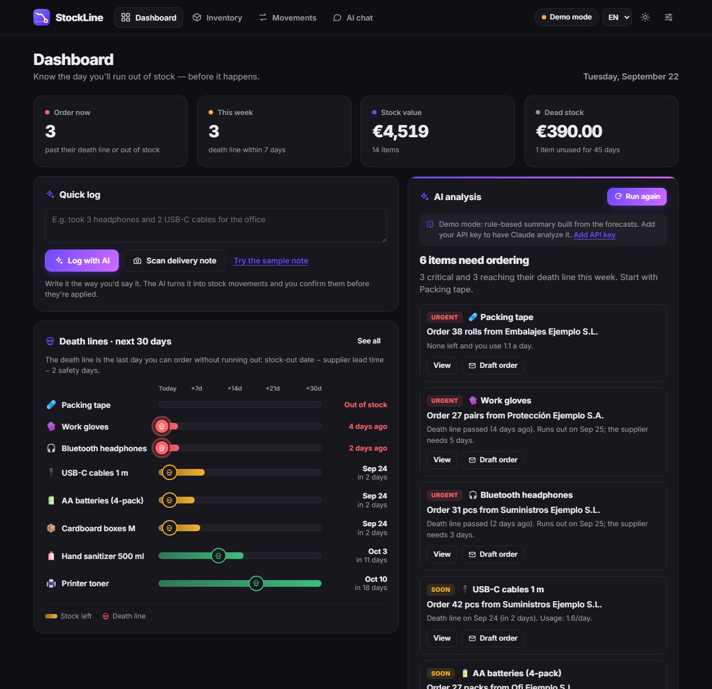
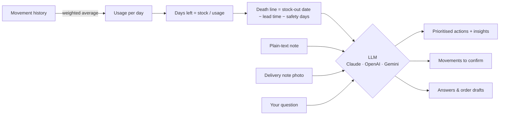

# ☠️ StockLine — know the day you'll run out of stock

**StockLine** is a tiny inventory app that predicts the **death line** of every item: the last day you can place an order and still receive it before you run out. On top of that forecast, an AI model of your choice — **Claude, OpenAI or Gemini** — prioritises what to buy, logs stock movements from plain text, reads delivery notes from a photo and answers questions about your stock.

No backend, no build step, no framework: HTML + CSS + vanilla JavaScript modules, hosted for free on GitHub Pages.

**[▶ Live demo](https://querii9.github.io/stockline/)** · works without an API key (demo mode)



---

## ✨ Features

| | Feature | How |
|---|---|---|
| 🔮 | **Death line forecast** for every item | Maths over the movement history (no AI needed, so it's free and reliable) |
| 🧠 | **AI analysis**: what to order today, how much, and what looks odd (dead stock, usage spikes, rising trends) | LLM + structured outputs (JSON schema) |
| 💬 | **Plain-text logging**: *"took 3 headphones and 2 USB-C cables for the Girona office"* → movements | LLM + structured outputs; you confirm before anything changes |
| 📸 | **Delivery note → stock**: take a photo of a delivery note or invoice and the lines become stock entries | Vision (image input); new products are detected and created |
| 🗨️ | **Chat with your inventory**, including ready-to-send purchase order drafts | Streamed token by token |
| 🔌 | **Bring your own AI**: Claude (Anthropic), OpenAI or Gemini (Google) | One small adapter per provider, each using its official SDK |
| 📊 | Stock history + forecast chart per item | Hand-drawn SVG, no chart library |
| 🌍 | Català · Español · English | One dictionary file, browser language auto-detected |
| 🌓 | Light / dark, responsive (bottom nav on mobile) | CSS custom properties |
| 💾 | Import / export JSON, export CSV | Data stays in your browser (localStorage) |

## 🧭 How it works

The design rule is simple: **numbers with maths, language with AI.**



- **Usage rate**: average units used per day over the last 30 days, with the last 15 days counting double, so recent changes show up fast.
- **Death line**: `stock-out date − supplier lead time − 2 safety days`. If it's in the past, you're already late.
- **Status**: `out` · `critical` (death line reached) · `warning` (death line within 7 days) · `ok` · `dead` (no usage for 45 days).
- The model receives this already-computed snapshot, so it reasons about decisions instead of doing arithmetic.
- **Human in the loop**: anything the AI proposes (from text or a photo) is shown for review before it touches the stock.

## 🔌 AI providers

Prompts and JSON schemas are shared; each provider has a small adapter in [`js/providers/`](js/providers) that maps them to its own API:

| Provider | Default model | API used | Get a key |
|---|---|---|---|
| **Claude** (Anthropic) | Claude Opus 5 | Messages API · structured outputs · `effort` · refusal fallback | [console.anthropic.com](https://console.anthropic.com/settings/keys) |
| **OpenAI** | GPT-5.6 | Responses API · strict JSON schema · `reasoning.effort` · `store: false` | [platform.openai.com](https://platform.openai.com/api-keys) |
| **Gemini** (Google) | Gemini 3.8 Flash | Interactions API · JSON response format · `thinking_level` · `store: false` | [aistudio.google.com](https://aistudio.google.com/apikey) |

Only the SDK of the provider you use is downloaded, and only when an AI feature runs.

## 🔑 Demo mode vs. live AI

A public static site can't hide an API key: anything in the JavaScript is visible to everyone. So StockLine has two modes:

- **Demo mode** (default, no key): forecasts are real; the AI features use rules and pre-computed samples and are clearly labelled as such. Anyone can try it.
- **Live mode**: pick a provider in ⚙️ Settings and paste your own API key. Each key is stored **only in your browser** and sent straight to that provider's API through its official SDK. Set a spend limit on the key, and don't use it on shared computers.

You can switch models in Settings and tune the reasoning effort per feature in `config.js`.

> **Note:** OpenAI's error responses (such as a wrong key) don't carry CORS headers, so the browser can't read them. When that happens StockLine tells you to check the key instead of showing a generic network error.

## 🚀 Run it locally

ES modules need a local server (opening `index.html` with a double click won't work):

```bash
python -m http.server 8000
```

Then open <http://localhost:8000>. (`npx serve` or VS Code's *Live Server* work too.)

## 🌐 Publish on GitHub Pages (free)

1. Create a repository and push these files.
2. **Settings → Pages → Build and deployment → Deploy from a branch → `main` / `(root)`**.
3. After a minute the app is live at `https://<your-user>.github.io/<repo>/`.
4. Optional: **Settings → General → Template repository**, so anyone can click **Use this template** and get their own copy.

## 🛠️ Make it yours

Almost everything is in [`js/config.js`](js/config.js):

| Setting | What it does |
|---|---|
| `appName`, `author`, `repoUrl`, `accentColor` | Branding and footer links |
| `defaultLanguage` | `"auto"`, `"ca"`, `"es"` or `"en"` |
| `currency` | Any ISO code (`EUR`, `USD`…) |
| `categories` | Your own categories, with a label per language |
| `forecast.*` | History window, safety days, warning threshold, dead-stock days, order coverage |
| `ai.provider` | Default provider: `"anthropic"`, `"openai"` or `"gemini"` |
| `ai.providers.*` | Models offered, default model, SDK version and key link for each provider |
| `ai.effort` | Reasoning effort per feature (`low` / `medium` / `high`) |

- **Add a language**: copy the `en` block in [`js/i18n.js`](js/i18n.js), translate it and add it to `LANGS`.
- **Add an AI provider**: create `js/providers/<name>.js` exporting `structured()`, `stream()` and `test()` (use the existing adapters as a template), then add it to `ADAPTERS` in [`js/ai.js`](js/ai.js) and to `ai.providers` in `config.js`.
- **Change the demo inventory**: edit `DEMO_ITEMS` in [`js/demo-data.js`](js/demo-data.js) (the history is generated automatically).
- **Change the prompts**: they're in [`js/ai.js`](js/ai.js), next to the JSON schemas the answers must follow.

## 📁 Project structure

```
index.html
css/styles.css          design tokens (light/dark) + layout
js/
  config.js             ← start here
  app.js                boot, header, routing (#/dashboard, #/inventory…)
  store.js              state + localStorage (data, preferences, one key per provider)
  forecast.js           death line maths (pure functions)
  ai.js                 prompts, JSON schemas, live vs demo, streaming
  ai-errors.js          one error type for every provider
  providers/            anthropic.js · openai.js · gemini.js
  ai-demo.js            demo-mode rules and samples
  demo-data.js          demo inventory + 60-day history generator
  charts.js             SVG stock chart
  i18n.js               translations + formatting
  ui.js                 icons, modals, toasts, event delegation
  views/                dashboard, inventory, movements, chat, review, settings
assets/                 logo + sample delivery note
```

## 🗺️ Ideas for next versions

- Barcode / QR scanning with the phone camera
- Offline PWA (installable)
- Shared inventory for a team (Supabase free tier)
- A tiny Cloudflare Worker proxy with rate limits, so visitors can try the live AI without their own key
- Weekly e-mail summary of death lines

## Català (resum)

**StockLine** és una mini app d'inventari que calcula la **death line** de cada material: l'últim dia per demanar sense quedar-te sense estoc. A sobre d'aquesta predicció, la IA que triïs (**Claude, OpenAI o Gemini**) prioritza què cal comprar, registra moviments a partir de text lliure («he tret 3 auriculars…»), llegeix albarans a partir d'una foto i respon preguntes sobre l'estoc. Funciona sense API key (mode demo) i amb la teva pròpia clau (IA en viu). Tot es personalitza des de `js/config.js`.

## Español (resumen)

**StockLine** es una mini app de inventario que calcula la **death line** de cada material: el último día para pedir sin quedarte sin stock. Sobre esa predicción, la IA que elijas (**Claude, OpenAI o Gemini**) prioriza qué comprar, registra movimientos a partir de texto libre («he sacado 3 auriculares…»), lee albaranes desde una foto y responde preguntas sobre el stock. Funciona sin API key (modo demo) y con tu propia clave (IA en vivo). Todo se personaliza desde `js/config.js`.

## 📄 License

[MIT](LICENSE). The demo data, suppliers and delivery note are fictional.
